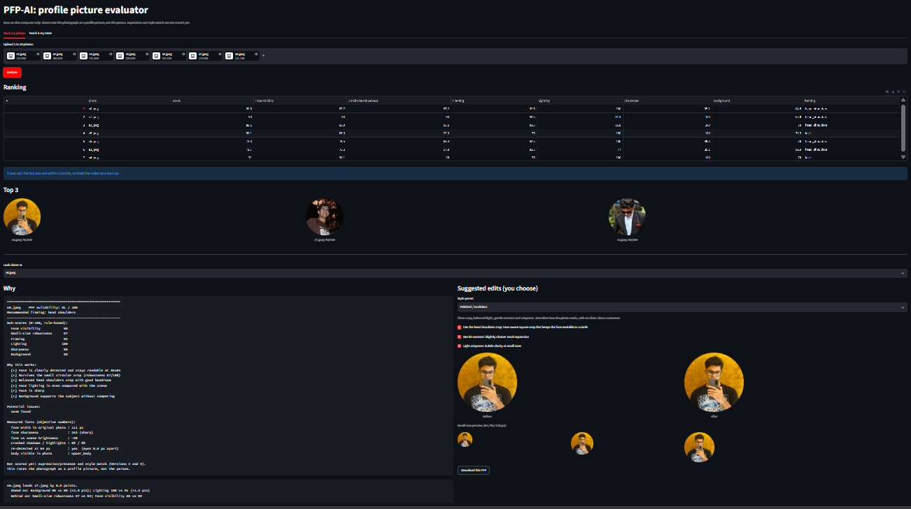

# PFP-AI

A local, CPU-only tool that looks at several photos of a person and recommends which works best as an Instagram profile picture (PFP). It explains its choice and suggests optional edits.



> **What this is not.** PFP-AI rates a *photograph* as a profile picture. It does not measure attractiveness, masculinity, status or dating success of the person, and never claims to.

## Status

| Version | What | State |
|---|---|---|
| 0 | Rule-based analyzer, ranking, explanations, edit suggestions, Streamlit UI | Done |
| 1 | Lightweight pretrained vision encoder (frozen embeddings) | Planned |
| 2 | Small trained scoring/ranking model from pairwise choices | Planned |
| 3 | Selectable styles (Chad-lite, Nonchalant, Mysterious, Clean, ...) | Planned |
| 4 | Optional AI editor via API, with consent and face-match check | Planned |

**Nothing is trained yet.** Version 0 uses two pretrained models as-is plus hand-written rules. All thresholds and weights are provisional and were tuned on a handful of photos, so expect mistakes.

## What it does

1. **Face detection** with OpenCV YuNet. If several faces appear, it picks the likely main subject and flags ambiguity.
2. **Image quality**: brightness, contrast, sharpness, exposure and noise, measured on the face and on the whole photo.
3. **PFP simulation**: square and circular crops at 64, 96, 128 and 256 px, then checks whether the face is still detected at 64 px.
4. **Body detection** with MediaPipe Pose, cross-checked against face size, because the pose model can invent hips that are not in the photo.
5. **Framing choice per photo**: tries face, head+shoulders, upper body and full body, and picks the best for that photo.
6. **Background analysis**: scenery bonus, clutter penalty, and a penalty for other people in the crop.
7. **Composition**: headroom, face size, position, and which edges cut the subject.
8. **Scoring and ranking**: six sub-scores (face visibility, small-size robustness, framing, lighting, sharpness, background) combined with weights from `config.json`.
9. **Explanations**: why a photo scored well, what the issues are, and why photo A beat photo B. Measured facts are kept separate from judgments.
10. **Edit suggestions** you can switch on or off, plus presets (Polished / confident, Warm film, Moody, Soft and bright). Edits only touch crop, light and colour, never faces or bodies.
11. **Pairwise voting page** that saves "which is the better PFP?" choices as training data for later versions.

## Privacy

Everything runs locally. Photos are never uploaded. Your photos, outputs and model files are excluded from Git by `.gitignore`.

## Get it running on your computer

You need Windows, Python 3.11 and Git. Check them first:

```powershell
python --version
git --version
```

If either command fails, install Python 3.11 from python.org (tick "Add Python to PATH") or Git from git-scm.com.

### 1. Download the project

```powershell
git clone https://github.com/YOUR-USERNAME/pfp-ai.git
cd pfp-ai
```

No Git? On the GitHub page, click **Code**, then **Download ZIP**, unzip it, and open PowerShell inside that folder.

### 2. Create an isolated environment and install packages

```powershell
python -m venv .venv
.venv\Scripts\activate
python -m pip install --upgrade pip
python -m pip install -r requirements.txt
```

Your prompt should now start with `(.venv)`. If activation is blocked, run `Set-ExecutionPolicy -Scope CurrentUser -ExecutionPolicy RemoteSigned` once and try again.

### 3. Download the two small model files

They are not stored in the repo, to keep it light (about 6 MB total).

```powershell
mkdir models\pretrained
Invoke-WebRequest -Uri "https://github.com/opencv/opencv_zoo/raw/main/models/face_detection_yunet/face_detection_yunet_2023mar.onnx" -OutFile "models\pretrained\face_detection_yunet_2023mar.onnx"
Invoke-WebRequest -Uri "https://storage.googleapis.com/mediapipe-models/pose_landmarker/pose_landmarker_lite/float16/latest/pose_landmarker_lite.task" -OutFile "models\pretrained\pose_landmarker_lite.task"
```

### 4. Check that everything works

```powershell
python check_env.py
python -m pytest -q
```

You want `RESULT: ALL GOOD` and all tests passing.

### 5. Start the app

```powershell
python -m streamlit run streamlit_app.py
```

Your browser opens at `http://localhost:8501`. Upload 1 to 20 photos and click **Analyze**. Press **Ctrl+C** in the terminal to stop it.

### Next time

You only need to repeat these three steps:

```powershell
cd pfp-ai
.venv\Scripts\activate
python -m streamlit run streamlit_app.py
```

### Common problems

| Problem | Fix |
|---|---|
| `python` is not recognized | Reinstall Python and tick "Add Python to PATH". |
| `YuNet model missing` | Redo step 3 and check `dir models\pretrained`. |
| `No module named ...` | The environment is not active. Run `.venv\Scripts\activate`. |
| `.heic` photos will not open | Install `pillow-heif` (it is in requirements.txt). |
| Port already in use | Close the old PowerShell window running Streamlit, or run with `--server.port 8502`. |

## Project layout

```text
app/            analysis code (detection, quality, framing, scoring, editing)
tests/          pytest tests, mostly on synthetic images
dataset/labels/ pairwise preference labels
config.json     scoring weights
streamlit_app.py  web UI
*_demo.py       command-line runners for each stage
```

## Design notes

- **Rules measure, they don't judge taste.** Sharpness, lighting and framing are measurable. Whether a photo has good presence is taste, and will be learned from human choices in Version 2.
- **Fairness.** Lighting uses relative signals (face vs scene, crushed shadows) rather than absolute face brightness, so skin tone is not penalised directly. Face-vs-scene is still not fully skin-tone neutral, and this must be tested on a diverse dataset.
- **Small faces.** Sharpness is judged on original pixels, so a tiny face in a wide photo is not marked "soft" because of our own upscaling.

## Known limitations

- Weights and thresholds are fitted to a few photos and will not generalise yet.
- The app currently disagrees with the author's own ranking, because expression, mood and style are not scored.
- Pairwise preferences are subjective and vary by culture and social circle.
- "Chad-lite", "Nonchalant" and similar are informal style labels, not objective categories.
- HEIC support needs `pillow-heif`. Some camera files may not open.

## Roadmap

Collect 100+ photos from several people with a few hundred pairwise votes, evaluate against baselines (random, largest face, quality only, generic aesthetic model), then train a small ranking head on frozen embeddings. Report pairwise accuracy, Spearman and Top-1 acceptance on held-out people.

## Credits and licenses

OpenCV YuNet (opencv_zoo) and Google MediaPipe Pose are used as pretrained models under their own licenses. Check them before redistributing the model files. This project is MIT licensed.